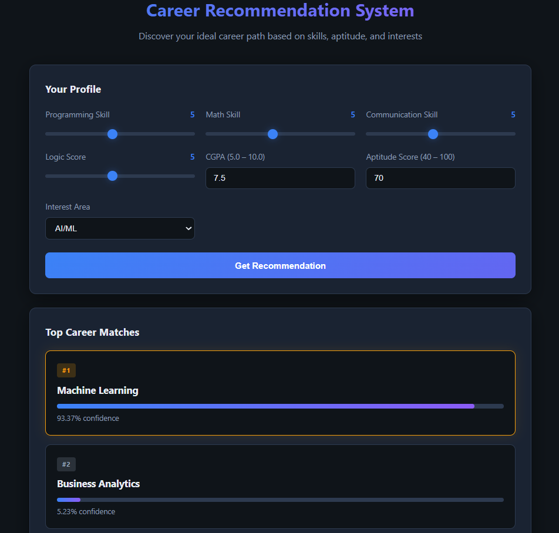

# Career Recommendation System

An end-to-end machine learning application that recommends careers to students based on their skills, academic performance, aptitude, and interest areas. Built with Python, scikit-learn, XGBoost, and Flask.

## Features

- **Synthetic dataset** of 3,000 student records with rule-based career labels and ~10% noise
- **Multi-model comparison**: Logistic Regression, Decision Tree, Random Forest, XGBoost
- **Sklearn preprocessing pipeline** (StandardScaler + OneHotEncoder) for consistent train/inference
- **Flask REST API** with top-3 career predictions and confidence scores
- **Skill gap analysis** and career descriptions for each recommended path
- **Modern web UI** with sliders, real-time updates, and animated results

## Project Structure

```
career-recommendation/
├── app.py                  # Flask backend
├── generate_dataset.py     # Synthetic data generation
├── train_model.py          # Model training & evaluation
├── requirements.txt
├── data/
│   └── career_dataset.csv
├── model/
│   ├── career_model.pkl
│   ├── preprocessor.pkl
│   ├── label_encoder.pkl
│   └── feature_names.pkl
├── templates/
│   └── index.html
├── static/
│   └── style.css
└── notebooks/
    ├── 01_data_generation.ipynb
    └── 02_eda_and_training.ipynb
```

## Setup

### Prerequisites

- Python 3.10+
- pip

### Installation

```bash
cd career-recommendation
pip install -r requirements.txt
```

## How to Run

### 1. Generate Dataset

```bash
py generate_dataset.py
```

Creates `data/career_dataset.csv` with 3,000 records.

### 2. Train Model

```bash
py train_model.py
```

Trains four classifiers, prints a comparison table, saves the best model and preprocessor to `model/`.

### 3. Start Flask App

```bash
py app.py
```

Open [http://localhost:5000](http://localhost:5000) in your browser.

## Screenshot

<!-- Add screenshot here after running the app -->


## Model Comparison

Results from `train_model.py` on an 80/20 stratified split (random_state=42):

| Model               | Accuracy | Precision | Recall | F1 Score |
|---------------------|----------|-----------|--------|----------|
| Logistic Regression | 0.7933   | 0.7946    | 0.7933 | 0.7921   |
| Decision Tree       | 0.7067   | 0.7110    | 0.7067 | 0.7052   |
| Random Forest       | 0.8183   | 0.8249    | 0.8183 | 0.8187   |
| **XGBoost (best)**  | **0.8400** | **0.8426** | **0.8400** | **0.8397** |

> Best model selected by weighted F1 score. Re-run `py train_model.py` to reproduce.

## API

### `POST /predict`

**Request body (JSON):**

```json
{
  "programming_skill": 8,
  "math_skill": 7,
  "communication_skill": 6,
  "logic_score": 7,
  "cgpa": 8.5,
  "aptitude_score": 75,
  "interest_area": "AI/ML"
}
```

**Response:**

```json
{
  "top_recommendations": [
    { "rank": 1, "career": "Machine Learning", "confidence": 42.5 },
    { "rank": 2, "career": "Data Science", "confidence": 28.3 },
    { "rank": 3, "career": "Software Development", "confidence": 12.1 }
  ],
  "top_career": {
    "name": "Machine Learning",
    "description": "...",
    "required_skills": ["..."]
  },
  "skill_gap_analysis": ["..."]
}
```

## Tech Stack

- **ML**: scikit-learn, XGBoost, pandas, numpy, joblib
- **Web**: Flask, vanilla HTML/CSS/JavaScript

## License

MIT

# Live Demo
https://career-recommendation-1496.onrender.com
